<p align="center">
  <picture>
    <source media="(prefers-color-scheme: dark)" srcset="assets/banner-dark.svg">
    
  </picture>
</p>

<p align="center">
  
</p>

---

## 👨‍💻 Sobre mim

```bash
$ whoami
Anderson Mohamed — estudante de Engenharia de Software
$ ./anderson --status
"aprendendo todos os dias, um commit por vez" 🚀
```

- 🎓 **Estudante de Engenharia de Software**
- 📍 **Brasil, Maranhão**
- 💡 Apaixonado por tecnologia, sempre em busca de conhecimento
- 🛠️ Explorando novas linguagens e ferramentas a cada projeto
- 🎯 Objetivo: construir soluções que façam a diferença

---

## 🚀 Projetos

<!-- Lista gerada automaticamente por scripts/update_projects.py (workflow Update Profile). Não edite à mão. -->
<!-- PROJECTS:START -->
| Projeto | Descrição | Stack |
| --- | --- | --- |
| 🔒 -RADAR-SULTS | — | HTML |
| 🔒 organizador-de-planilhas | — | Python |
| 🔒 SITE | — | JavaScript |
| 🔒 CALCULO-DE-DINHEIRO | — | JavaScript |
| 🔒 Ola-mundo | primeiro repositório | — |
<!-- PROJECTS:END -->

---

## 📊 GitHub Stats

> 💡 Os cards abaixo são gerados e versionados neste repositório por GitHub Actions a cada 3 horas, incluindo dados de repositórios privados. A lista de projetos é atualizada automaticamente.

<p align="center">
  <picture>
    <source media="(prefers-color-scheme: dark)" srcset="profile/stats-dark.svg">
    
  </picture>
  <picture>
    <source media="(prefers-color-scheme: dark)" srcset="profile/top-langs-dark.svg">
    
  </picture>
</p>

<p align="center">
  <picture>
    <source media="(prefers-color-scheme: dark)" srcset="profile/streak-dark.svg">
    
  </picture>
</p>

---

## 🏆 Conquistas

<p align="center">
  
</p>

---

## 🐍 Contribuições

<p align="center">
  
</p>

---

## 🛠️ Tecnologias

<!-- ✏️ Edite esta seção conforme aprende novas tecnologias. O card "Top Linguagens" acima já reflete automaticamente as mais usadas nos repositórios. -->

<p align="center">
  
  
  
</p>

---

## 📫 Vamos conversar?

<p align="center">
  <a href="https://www.linkedin.com/in/anderson-mohamed-260b672b9">
    
  </a>
  <a href="https://github.com/AndersonMohamed">
    
  </a>
</p>

<p align="center">
  
</p>